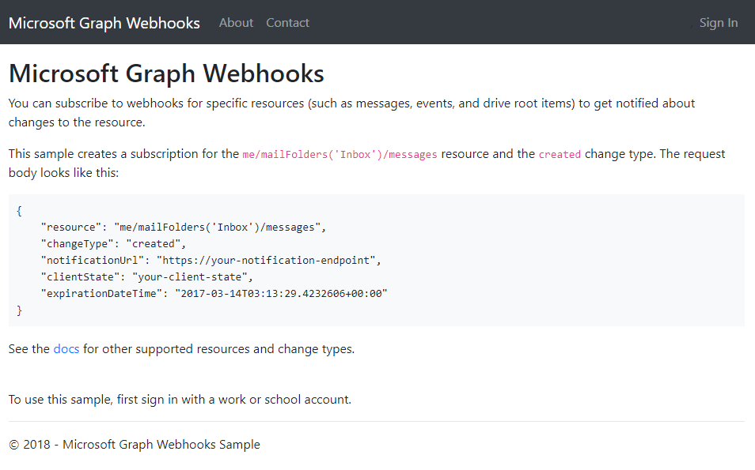
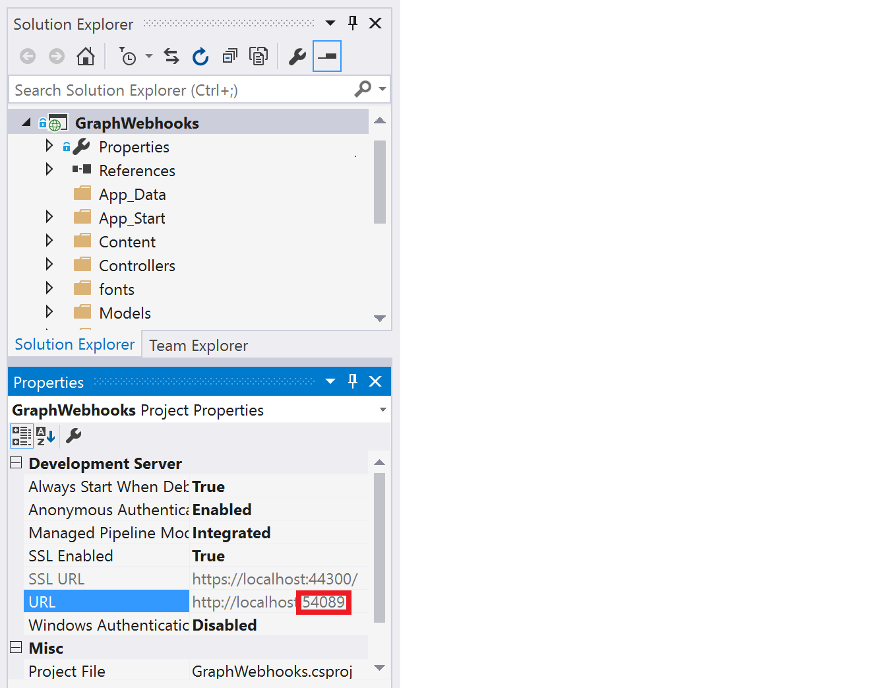
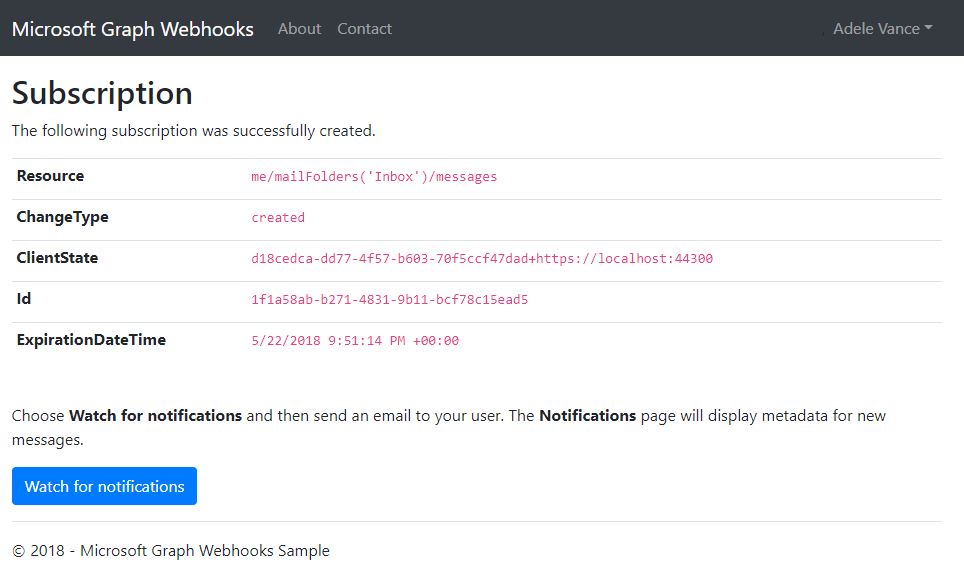

# Microsoft Graph ASP.NET Webhooks

Subscribe for [Microsoft Graph webhooks](https://developer.microsoft.com/en-us/graph/docs/api-reference/v1.0/resources/webhooks) to be notified when your user's data changes so you don't have to poll for changes.

This ASP.NET MVC sample shows how to start getting notifications from Microsoft Graph. Microsoft Graph provides a unified API endpoint to access data from the Microsoft cloud. 

>This sample uses the Azure AD endpoint to obtain an access token for work or school accounts. The sample uses a user-delegated permission, but messages, events, and contacts resources also support application (app-only) permissions. Currently, only drive root item resources support subscriptions for personal accounts. Watch the docs as we continue to add support for these and other features.

The following are common tasks that an application performs with webhooks subscriptions:

- Get consent to subscribe to users' resources and then get an access token.
- Use the access token to [create a subscription](https://developer.microsoft.com/en-us/graph/docs/api-reference/v1.0/api/subscription_post_subscriptions) to a resource.
- Send back a validation token to confirm the notification URL.
- Listen for notifications from Microsoft Graph and respond with a 202 status code.
- Request more information about changed resources using data in the notification.
  
This screenshot shows the app's start page after the user signs in. 



After the app creates a subscription on behalf of the signed-in user, Microsoft Graph sends a notification to the registered endpoint when events happen in the user's data. The app then reacts to the event.

This sample subscribes to the `me/mailFolders('Inbox')/messages` resource for `created` changes. It gets notified when the user receives an email message, and then updates a page with information about the message. 

## Prerequisites

To use the Microsoft Graph ASP.NET Webhooks sample, you need the following:

* Visual Studio 2015 installed on your development computer. 

* A [work or school account](http://dev.office.com/devprogram).

* The application ID and key from the application that you [register on the Azure Portal](#register-the-app).

* A public HTTPS endpoint to receive and send HTTP requests. You can host this on Microsoft Azure or another service, or you can [use ngrok](#ngrok) or a similar tool while testing.

### Register the app

This app uses the Azure AD endpoint, so you'll register it in the [Azure Portal](https://portal.azure.com/).

1. Sign in to the portal using your work or school account.

2. Choose **Azure Active Directory** in the left-hand navigation pane.

3. Choose **App registrations**, and then choose **Add**.  

   a. Enter a friendly name for the application.

   b. Choose 'Web app/API' as the **Application Type**.

   c. Enter *https://localhost:44300/* for the **Sign-on URL**. 
  
   d. Click **Create**.

4. Choose your new application from the list of registered applications.

5. Copy and store the Application ID. This value is shown in the **Essentials** pane or in **Settings** > **Properties**.

6. To enable multi-tenanted support for the app, choose **Settings** > **Properties** and set **Multi-tenanted** to **Yes**.

7. Configure Permissions for your application:  

   a. Choose **Settings** > **Required permissions** > **Add**.
  
   b. Choose **Select an API** > **Microsoft Graph**, and then click **Select**.
  
   c. Choose **Select permissions**, scroll down to **Delegated Permissions**, choose **Read user mail**, and then click **Select**.
  
   d. Click **Done**.

8. Choose **Settings** > **Keys**. Enter a description, choose a duration for the key, and then click **Save**.

9. **Important**: Copy the key value--this is your app's secret. You won't be able to access this value again after you leave this blade.

You'll use the application ID and secret to configure the app in Visual Studio.


<a name="ngrok"></a>
### Set up the ngrok proxy (optional) 
You must expose a public HTTPS endpoint to create a subscription and receive notifications from Microsoft Graph. While testing, you can use ngrok to temporarily allow messages from Microsoft Graph to tunnel to a *localhost* port on your computer. 

You can use the ngrok web interface (http://127.0.0.1:4040) to inspect the HTTP traffic that passes through the tunnel. To learn more about using ngrok, see the [ngrok website](https://ngrok.com/).  

1. In Solution Explorer, select the **GraphWebhooks** project.

1. Copy the **URL** port number from the **Properties** window. If the **Properties** window isn't showing, choose **View > Properties Window**. 

	

1. [Download ngrok](https://ngrok.com/download) for Windows.  

1. Unzip the package and run ngrok.exe.

1. Replace the two *{port-number}* placeholder values in the following command with the port number you copied, and then run the command in the ngrok console.

   `ngrok http {port-number} -host-header=localhost:{port-number}`

	

1. Copy the HTTPS URL that's shown in the console. You'll use this to configure your notification URL in the sample.

	

   >Keep the console open while testing. If you close it, the tunnel also closes and you'll need to generate a new URL and update the sample.

See [Hosting without a tunnel](https://github.com/microsoftgraph/nodejs-webhooks-rest-sample/wiki/Hosting-the-sample-without-a-tunnel) and [Why do I have to use a tunnel?](https://github.com/microsoftgraph/nodejs-webhooks-rest-sample/wiki/Why-do-I-have-to-use-a-tunnel) for more information.


## Configure and run the sample

1. Expose a public HTTPS notification endpoint. It can run on a service such as Microsoft Azure, or you can create a proxy web server by [using ngrok](#ngrok) or a similar tool.

1. Open **GraphWebhooks.sln** in the sample files. 

      >You may be prompted to trust certificates for localhost.

1. In Solution Explorer, open the **Web.config** file in the root directory of the project.  
   a. For the **ClientId** key, replace *ENTER_YOUR_APP_ID* with the application ID of your registered Azure application.  
 
   b. For the **ClientSecret** key, replace *ENTER_YOUR_SECRET* with the key of your registered Azure application.  

   c. For the **NotificationUrl** key, replace *ENTER_YOUR_URL* with the HTTPS URL. Keep the */notification/listen* portion. If you're using ngrok, use the HTTPS URL that you copied. The value will look something like this:

   ```xml
<add key="ida:NotificationUrl" value="https://0f6fd138.ngrok.io/notification/listen" />
   ```

1. Make sure that the ngrok console is still running, then press F5 to build and run the solution in debug mode. 

### Use the app
 
1. Sign in with your work or school account. 

1. Consent to the **Read your mail** and **Sign you in and read your profile** permissions. 
    
   If you don't see the **Read your mail** permission, choose **Cancel** and then add the **Read user mail** permission to the app in the Azure Portal. See the [Register the app](#register-the-app) section for instructions.

1. Choose the **Create subscription** button. The **Subscription** page loads with information about the subscription.

	
	
1. Choose the **Watch for notifications** button.

1. Send an email to your work or school account. The **Notification** page displays some message properties. It may take several seconds for the page to update.
   
	

1. Choose the **Delete subscription and sign out** button. 

>If you update any dependencies for this sample, be sure **not** to update System.IdentityModel.Tokens.Jwt to v5, which is designed for use with .NET Core.

## Key components of the sample

**Controllers**  
- [`NotificationController.cs`](https://github.com/microsoftgraph/aspnet-webhooks-rest-sample/blob/master/GraphWebhooks/Controllers/NotificationController.cs) Receives notifications.  
- [`SubscriptionContoller.cs`](https://github.com/microsoftgraph/aspnet-webhooks-rest-sample/blob/master/GraphWebhooks/Controllers/SubscriptionController.cs) Creates and receives webhook subscriptions.
 
**Models**  
- [`Message.cs`](https://github.com/microsoftgraph/aspnet-webhooks-rest-sample/blob/master/GraphWebhooks/Models/Message.cs) Represents an Outlook mail message. 
- [`Notification.cs`](https://github.com/microsoftgraph/aspnet-webhooks-rest-sample/blob/master/GraphWebhooks/Models/Notification.cs) Represents a change notification. 
- [`Subscription.cs`](https://github.com/microsoftgraph/aspnet-webhooks-rest-sample/blob/master/GraphWebhooks/Models/Subscription.cs) Represents a webhook subscription. Also defines the **SubscriptionViewModel** that represents the data displayed in the Subscription view. 

**Views**  
- [`Notification/Notification.cshtml`](https://github.com/microsoftgraph/aspnet-webhooks-rest-sample/blob/master/GraphWebhooks/Views/Notification/Notification.cshtml) Displays information about received messages, and contains the **Delete subscription and sign out** button. 
- [`Subscription/Index.cshtml`](https://github.com/microsoftgraph/aspnet-webhooks-rest-sample/blob/master/GraphWebhooks/Views/Subscription/Index.cshtml) Landing page that contains the **Create subscription** button. 
- [`Subscription/Subscription.cshtml`](https://github.com/microsoftgraph/aspnet-webhooks-rest-sample/blob/master/GraphWebhooks/Views/Subscription/Subscription.cshtml) Displays subscription properties, and contains the **Watch for notifications** button. 

**Other**  
- [`Web.config`](https://github.com/microsoftgraph/aspnet-webhooks-rest-sample/blob/master/GraphWebhooks/Web.config) Contains values used for authentication and authorization. 
- [`App_Start/Startup.Auth.cs`](https://github.com/microsoftgraph/aspnet-webhooks-rest-sample/blob/master/GraphWebhooks/App_Start/Startup.Auth.cs) and [`Helpers/AuthHelper`](https://github.com/microsoftgraph/aspnet-webhooks-rest-sample/blob/master/GraphWebhooks/Helpers/AuthHelper.cs) Contain code used for authentication and authorization. The sample uses [OpenID Connect](https://msdn.microsoft.com/en-us/library/azure/dn645541.aspx) and [Active Directory Authentication Library .NET (v3)](https://github.com/AzureAD/azure-activedirectory-library-for-dotnet) to authenticate and authorize the user.
- [`TokenStorage/SampleTokenCache.cs`](https://github.com/microsoftgraph/aspnet-webhooks-rest-sample/blob/master/GraphWebhooks/TokenStorage/SampleTokenCache.cs) Sample implementation of a token cache that uses HttpRuntime.Cache (so that token information is available when a notification is received). Production apps will typically use some method of persistent storage. 


## Troubleshooting

| Issue | Resolution |
|:------|:------|
| You get a 403 Forbidden response when you attempt to create a subscription. | Make sure that your app registration includes the **Read user mail** delegated permission for Microsoft Graph (as described in the [Register the app](#register-the-app) section). This permission must be set before your user gives consent. Otherwise you'll need to register a new app, add the `consent=prompt` parameter for the `/authorize` request, or remove the app for the user at [https://myapps.microsoft.com/](https://myapps.microsoft.com/). |  
| You do not receive notifications. | If you're using ngrok, you can use the web interface (http://127.0.0.1:4040) to see whether the notification is being received. If you're not using ngrok, monitor the network traffic using the tools your hosting service provides, or try using ngrok.<br />If Microsoft Graph is not sending notifications, please open a [Stack Overflow](https://stackoverflow.com/questions/tagged/MicrosoftGraph) issue tagged *[MicrosoftGraph]*. Include the subscription ID and the time it was created.<br /><br />Known issue with the sample UI: Occasionally the notification is received, and the retrieved message is sent to NotificationService, but the SignalR client in this sample does not update. When this happens, it's usually the first notification after the subscription is created. |  
| You get a *Subscription validation request timed out* response. | This indicates that Microsoft Graph did not receive a validation response.<br /><br />If you're using ngrok, make sure that you used your project's HTTP port for the tunnel (not HTTPS). |  
| The app opens to a *Server Error in '/' Application. The resource cannot be found.* browser page. | Make sure that a CSHTML view file isn't the active tab when you run the app from Visual Studio. |

<a name="contributing"></a>
## Contributing ##

If you'd like to contribute to this sample, see [CONTRIBUTING.MD](/CONTRIBUTING.md).

This project has adopted the [Microsoft Open Source Code of Conduct](https://opensource.microsoft.com/codeofconduct/). For more information see the [Code of Conduct FAQ](https://opensource.microsoft.com/codeofconduct/faq/) or contact [opencode@microsoft.com](mailto:opencode@microsoft.com) with any additional questions or comments.

## Questions and comments

We'd love to get your feedback about the Microsoft Graph ASP.NET Webhooks sample. You can send your questions and suggestions to us in the [Issues](https://github.com/microsoftgraph/aspnet-webhooks-rest-sample/issues) section of this repository.

Questions about Microsoft Graph in general should be posted to [Stack Overflow](https://stackoverflow.com/questions/tagged/MicrosoftGraph). Make sure that your questions or comments are tagged with *[MicrosoftGraph]*.

You can suggest changes for Microsoft Graph on [GitHub](https://github.com/microsoftgraph/microsoft-graph-docs).

## Additional resources

* [Microsoft Graph Node.js Webhooks sample](https://github.com/microsoftgraph/nodejs-webhooks-rest-sample)
* [Working with Webhooks in Microsoft Graph](https://developer.microsoft.com/en-us/graph/docs/api-reference/v1.0/resources/webhooks)
* [Subscription resource](https://developer.microsoft.com/en-us/graph/docs/api-reference/v1.0/resources/subscription)
* [Microsoft Graph documentation](https://developer.microsoft.com/en-us/graph/)
* [Call Microsoft Graph in an ASP.NET MVC app](https://developer.microsoft.com/en-us/graph/docs/platform/aspnetmvc)

## Copyright
Copyright (c) 2017 Microsoft. All rights reserved.
